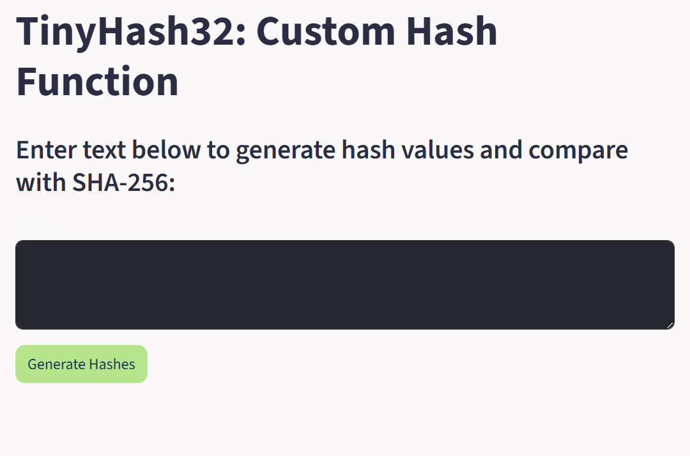
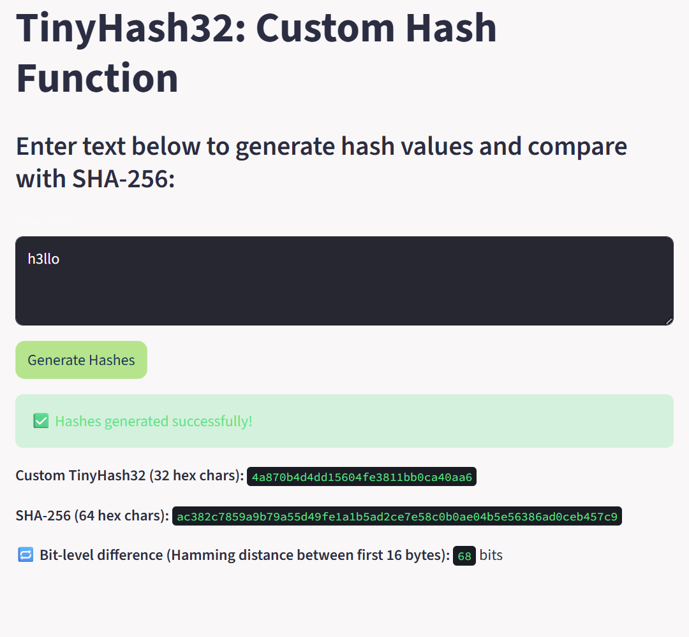

# 🔐 TinyHash32: Custom Hash Function in Python
 

---

## 🌟 Overview

**TinyHash32** is a Python project that demonstrates the **fundamentals of hashing** by designing a **custom hash algorithm** and comparing it with the standard **SHA-256** function.  
The project includes a **Streamlit-based GUI** with a **pastel color theme**, making it interactive and visually appealing.

---

## 🎯 Objectives

- Understand the basics of hashing and how hash functions work.  
- Design and implement a custom hash function (`TinyHash32`) using:
  - Character manipulation (ASCII operations)
  - Modular arithmetic
  - Bitwise operations (XOR, rotation)
- Produce a fixed-length hash (32 hex characters).  
- Compare results and avalanche effects with **SHA-256**.  
- Create a GUI using **Streamlit**.

---

## 🧩 Algorithm: TinyHash32

### **Input:**  
Any user-defined string (plaintext)

### **Output:**  
Fixed-length 32-character hexadecimal hash

### **Steps:**
1. Convert the input string into bytes (`UTF-8` encoding).  
2. Initialize four 32-bit state words from constants and input length.  
3. Process input in 8-byte blocks:
   - Split into two 32-bit chunks.
   - Apply XOR, addition, rotation, and modular arithmetic.
4. Mix remaining bytes (padding if needed).  
5. Finalize using multiple mixing rounds for diffusion.  
6. Output final digest as a **32-character hexadecimal hash**.

---

## 🧠 Features

✅ Fixed 32-character hash output  
✅ Handles empty and long strings gracefully  
✅ Demonstrates the **avalanche effect**  
✅ Side-by-side comparison with **SHA-256**  
✅ Simple and aesthetic **Streamlit GUI**  
✅ Educational (not for cryptographic use)

---


---

## 🚀 How to Run

### **1️⃣ Clone the Repository**
```bash
git clone https://github.com/yourusername/tinyhash32.git
cd tinyhash32
2️⃣ Install Dependencies
bash
Copy code
pip install streamlit
3️⃣ Run the Streamlit App
bash
Copy code
streamlit run app.py
```
Then open the link shown in your terminal (usually http://localhost:8501).


📸 Screenshots
Streamlit GUI   
TinyHash32 vs SHA-256 output comparison   
Avalanche demonstration ("hello" vs "h3llo")   


⚠️ Disclaimer
This project is for educational purposes only.
TinyHash32 is not a secure cryptographic hash function and should not be used in production or for sensitive data.

🧑‍🏫 Acknowledgment
Developed as part of an academic exercise to explore the fundamentals of hashing and its comparison with SHA-256.
Guided by Priyanksha Das.

